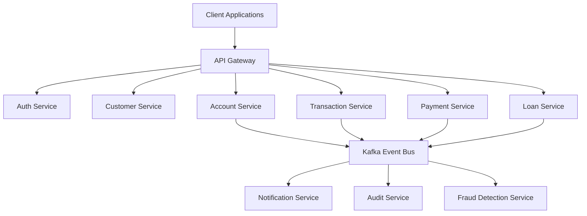

# Nexora Banking Platform

Nexora Banking Platform is a cloud-native banking ecosystem built using Java, Spring Boot, Spring Cloud, Kafka, MySQL, Redis, Docker, and Kubernetes.

The platform is designed using microservices architecture and demonstrates real-world banking capabilities such as customer onboarding, account management, fund transfers, payment processing, loan management, notifications, fraud detection, and audit tracking.

The primary goal of this project is to showcase enterprise-grade backend engineering practices including distributed systems, event-driven architecture, observability, security, CI/CD automation, and cloud-native deployment.

## Architecture

## Technology Stack

### Backend
- Java 21
- Spring Boot 3
- Spring Security
- Spring Cloud

### Data
- PostgreSQL
- Redis

### Messaging
- Apache Kafka

### DevOps
- Docker
- Kubernetes
- GitHub Actions

### Observability
- Prometheus
- Grafana
- OpenTelemetry

## Prerequisites
- Java 21+
- Docker
- Docker Compose
- Kubernetes (Minikube or Kind)
- PostgreSQL
- Maven 3.9+

## Features
- Customer Registration
- KYC Workflow
- Account Management
- Fund Transfer
- Transaction History
- Beneficiary Management
- Loan Processing
- Notification Service
- Audit Logging
- Fraud Detection
- JWT Authentication
- Role Based Access Control

## Documentation

| Topic | Link |
|---------|------|
| System Architecture | docs/architecture |
| API Documentation | docs/api |
| Deployment Guide | docs/deployment |
| Security Guide | docs/security |
| Monitoring Guide | docs/monitoring |

## Screenshots

- Architecture Diagram
- Swagger UI
- Kafka Event Flow
- Grafana Dashboard
- Prometheus Metrics
- Kubernetes Deployment

## Roadmap

- [x] Authentication Service
- [x] Customer Service
- [x] Account Service
- [ ] Loan Service
- [ ] Fraud Detection
- [ ] Kubernetes Deployment
- [ ] CI/CD Pipeline

## Engineering Highlights

- Distributed Microservices Architecture
- Event-Driven Communication using Kafka
- JWT Authentication & RBAC
- Distributed Tracing with OpenTelemetry
- Containerized Deployment using Docker
- Kubernetes Orchestration
- Centralized Logging
- Monitoring with Prometheus & Grafana
- CI/CD using GitHub Actions

