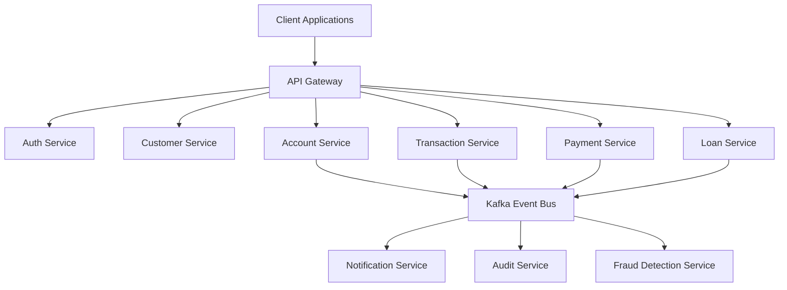

# Nexora Banking Platform


Nexora Banking Platform is a cloud-native banking ecosystem built using Java, Spring Boot, Spring Cloud, Kafka, MySQL, Redis, Docker, and Kubernetes.

The platform is designed using microservices architecture and demonstrates real-world banking capabilities such as customer onboarding, account management, fund transfers, payment processing, loan management, notifications, fraud detection, and audit tracking.

The primary goal of this project is to showcase enterprise-grade backend engineering practices including distributed systems, event-driven architecture, observability, security, CI/CD automation, and cloud-native deployment.


## Architecture


## Repository Structure

```text
nexora-banking-platform
├── auth-service
├── customer-service
├── account-service
├── transaction-service
├── payment-service
├── loan-service
├── notification-service
├── audit-service
├── fraud-service
├── api-gateway
├── config-server
├── discovery-server
├── docs
└── infrastructure
```
## Technology Stack

### Backend
- Java 21
- Spring Boot 3
- Spring Security
- Spring Cloud

### Data
- PostgreSQL
- Redis

### Messaging
- Apache Kafka

### DevOps
- Docker
- Kubernetes
- GitHub Actions

### Observability
- Prometheus
- Grafana
- OpenTelemetry


## Prerequisites
- Java 21+
- Docker
- Docker Compose
- Kubernetes (Minikube or Kind)
- PostgreSQL
- Maven 3.9+

## Key Features

🔐 **Authentication & Authorization**
- JWT-based authentication
- Role-based access control

👤 **Customer Management**
- Customer onboarding
- KYC workflow
- Profile management

🏦 **Account Management**
- Account creation
- Balance inquiry
- Account lifecycle management

💸 **Fund Transfers**
- Internal account transfers
- Transaction history
- Transfer validation

📧 **Notifications**
- Email notifications
- SMS alerts
- Event-driven messaging

🛡️ **Fraud Detection**
- Transaction monitoring
- Risk flag generation

📊 **Audit & Compliance**
- Audit trail
- Event logging
- Activity tracking

## Documentation

| Topic | Link |
|---------|------|
| System Architecture | docs/architecture |
| API Documentation | docs/api |
| Deployment Guide | docs/deployment |
| Security Guide | docs/security |
| Monitoring Guide | docs/monitoring |

## Screenshots

- Architecture Diagram
- Swagger UI
- Kafka Event Flow
- Grafana Dashboard
- Prometheus Metrics
- Kubernetes Deployment


## Roadmap

- [x] Authentication Service
- [x] Customer Service
- [x] Account Service
- [ ] Loan Service
- [ ] Fraud Detection
- [ ] Kubernetes Deployment
- [ ] CI/CD Pipeline

```markdown
## API Documentation

| Service | Swagger URL |
|----------|-------------|
| Auth Service | /swagger-ui |
| Customer Service | /swagger-ui |
| Account Service | /swagger-ui |
```
## Security

- JWT Authentication
- Role-Based Access Control
- Password Encryption using BCrypt
- API Gateway Security
- Input Validation
- Secure Configuration Management

## Monitoring & Observability

- Prometheus Metrics
- Grafana Dashboards
- Centralized Logging
- Distributed Tracing
- Health Checks

## CI/CD Pipeline

- Build Verification
- Unit Testing
- Code Quality Checks
- Docker Image Build
- Kubernetes Deployment

## Engineering Highlights

- Distributed Microservices Architecture
- Event-Driven Communication using Kafka
- JWT Authentication & RBAC
- Distributed Tracing with OpenTelemetry
- Containerized Deployment using Docker
- Kubernetes Orchestration
- Centralized Logging
- Monitoring with Prometheus & Grafana
- CI/CD using GitHub Actions


